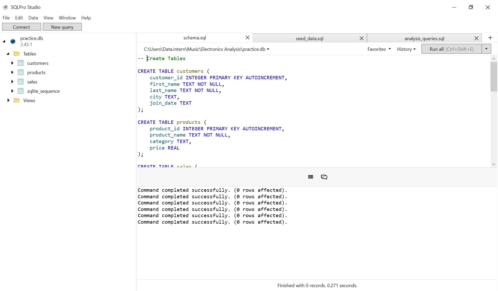
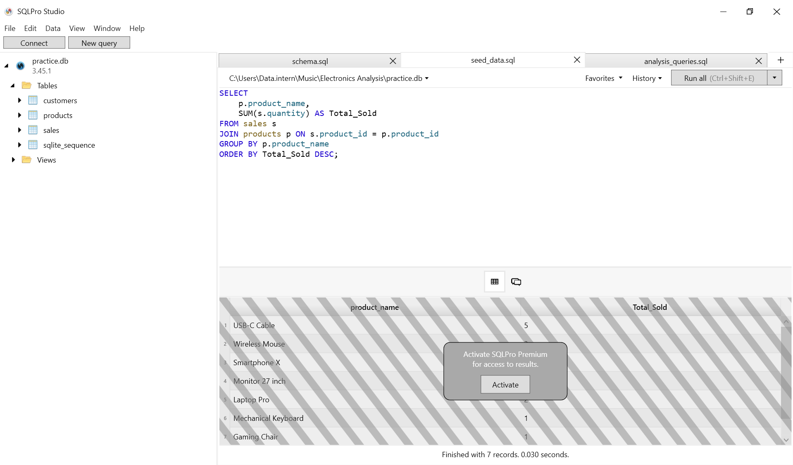
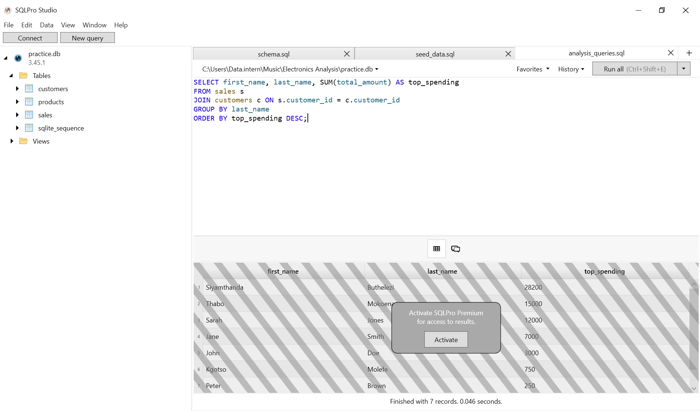

# Electronics Store Sales Analysis

## Overview
This project simulates a sales database for an electronics store. The goal is to demonstrate SQL skills in database design, data manipulation, and analytical querying.

## Schema Design
The database consists of three normalized tables:

- *Customers:* Stores customer demographic data.
- *Products:* Stores product details and pricing.
- *Sales:* Transactional records linking customers to purchased products.

## Key Insights

- *Total Revenue:* Calculated aggregate sales.

- *Top Selling Products:* Identified best performers by quantity sold.

- *Customer Value:* Analyzed customer spending habits to identify top buyers.

## Tools Used

`SQL (SQLite syntax)`

`SQLPro Studio`
